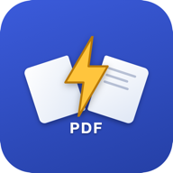
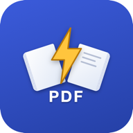
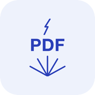
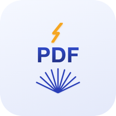
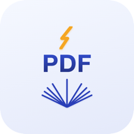
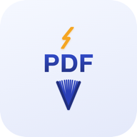
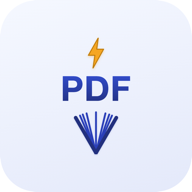
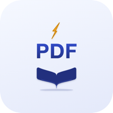
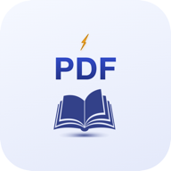

# PDF 阅读器

小米手机本地 PDF 阅读器（Android，Kotlin，TDD 开发）。把 PDF 抽取重排成适合手机竖屏阅读的流式文本，而不是简单的整页缩放。

## 这个应用做什么

- 打开本地 PDF（支持"用其他应用打开"把别处的 PDF 分享进来）
- 把文字按视觉位置重新抽取、按屏幕宽度重排（reflow），中英文/数字间距按规则规范化，不用来回横向拖动看一行字
- 图片、表格按原页面位置浮动展示，支持双指缩放
- 识别并跳过打印/导出 PDF 常见的页眉页脚水印（日期、网址、页码）
- 目录（大纲）跳转，支持定位到页内精确位置，不只是跳到整页开头
- 字号/行距/边距可调，即时生效并持久化
- 阅读进度按文件内容哈希 + 页码记忆，换了文件不会读错进度
- 深色模式、系统栏适配
- 大文档（几千页）按页懒加载，不会因为一次性渲染全文而内存溢出

## 为什么不用现成的 PDF 渲染库直接显示

多数 PDF 阅读器就是把每一页整页渲染成图片给你缩放平移——在手机竖屏上看双栏论文或扫描版书籍会很痛苦：字小到看不清就得一直横向拖动。这个应用选了更难但更好用的路线：解析 PDF 的 content stream，按视觉阅读顺序重新抽取文字，再按屏幕宽度重排成流式文本，图片和表格单独摘出来按原位置浮动展示。

代价是要处理大量真实 PDF 的边缘情况——不同来源（浏览器打印、Office 导出、扫描件）的内部结构千差万别。开发过程中踩到的具体坑（部首变体字符、CMYK JPEG 花屏、图片朝向的坐标变换符号错误、Chromium 打印表格用填充矩形而非描边线……）都记在 [NOTES.md](NOTES.md) 里。

## 技术选型

- **PDF 解析**：[PdfBox-Android](https://github.com/TomRoush/PdfBox-Android)。原计划用 MuPDF，调研后确认它没有官方发布到 Maven Central 的预编译 aar，能找到的坐标是第三方 fork 重新发布的二进制，供应链信任度不足，改用纯 Java/Kotlin 实现、Apache 2.0 许可证的 PdfBox-Android。
- **列表渲染**：RecyclerView 按需加载，条目粒度=页，只创建/保留屏幕附近的 ViewHolder，解决超大文档的内存问题。
- **开发方式**：TDD（测试先行）。核心逻辑（reflow、文字/图片抽取、表格检测、间距规范化……）都是先写失败测试（red）再实现（green）的配对提交。

## 权限说明

不需要网络权限，PDF 全部来自本地（系统文件选择器或"用其他应用打开"）。

## 构建

需要 JDK 17（Android 侧编译）和 JDK 21（跑测试——依赖的 Robolectric 4.16.1 要求 JVM ≥ 21）。不需要 Android Studio。

```bash
# 指向你的 SDK
echo "sdk.dir=$HOME/Library/Android/sdk" > local.properties

# 跑测试必须用 JDK 21，否则 Robolectric 初始化直接报错
export JAVA_HOME=/usr/local/opt/openjdk@21
gradle test

# 出 APK 用默认 JDK 即可
gradle assembleDebug
# 产物在 app/build/outputs/apk/debug/app-debug.apk
```

安装到手机（需先开启开发者选项与 USB 调试）：

```bash
adb install -r app/build/outputs/apk/debug/app-debug.apk
```

更多真机踩坑细节（工具链版本坑、PdfBox 已知 bug、字体渲染细节……）见 [NOTES.md](NOTES.md)。

## App 图标演变

2026-08-21 当天集中迭代，一共改了 12 次：从深蓝实心插画风格（v1-v2）改成浅色线条画风格定调（v3），之后反复微调书本形状、书页疏密和闪电的大小/位置（v4-v11），最新一版把闪电用程序化测量精确嵌进了 PDF 的"D"字母镂空正中央（v12，当前线上版本）。每一版实际图标见下表（截自对应 git 提交，`git log --oneline | grep 图标` 可查完整改动记录）：

<table>
<tr>
<td align="center" width="150"><br><sub><b>v1</b> <code>1f57b42</code><br>初版：闪电+摊开的书+PDF</sub></td>
<td align="center" width="150"><br><sub><b>v2</b> <code>e56abb4</code><br>书页加厚度纹理，PDF 字号调大</sub></td>
<td align="center" width="150"><br><sub><b>v3</b> <code>637ad5e</code><br>改版：手绘草图线条画风格</sub></td>
<td align="center" width="150"><br><sub><b>v4</b> <code>5bd4c90</code><br>闪电加粗，书页 5→9 条</sub></td>
</tr>
<tr>
<td align="center"><br><sub><b>v5</b> <code>8101759</code><br>书页角度中间稀两侧密</sub></td>
<td align="center"><br><sub><b>v6</b> <code>706a240</code><br>书本 45° 张角+书皮加粗</sub></td>
<td align="center"><br><sub><b>v7</b> <code>1e8b91f</code><br>书本 60° 张角+闪电实心两头尖</sub></td>
<td align="center"><br><sub><b>v8</b> <code>151275c</code><br>书本改实心剪影（照参考图）</sub></td>
</tr>
<tr>
<td align="center"><br><sub><b>v9</b> <code>87cf8e5</code><br>书本直接复用参考图</sub></td>
<td align="center"><br><sub><b>v10</b> <code>585629c</code><br>闪电挪到字母 D 镂空处</sub></td>
<td align="center"><br><sub><b>v11</b> <code>e7172c4</code><br>闪电缩小+微调，完整显示在 D 内</sub></td>
<td align="center"><br><sub><b>v12</b> <code>e84332d</code><br>闪电程序化精确定位（当前版）</sub></td>
</tr>
</table>

## 开发统计（截至 2026-08-24）

- **代码量**：11351 行（Kotlin 主代码 6786 行、Kotlin 测试代码 4565 行、XML 375 行、Gradle 脚本 117 行），另有 1209 行 NOTES.md 踩坑记录。
- **提交次数**：118 次，标准 TDD 节奏（`test: ...(red)` 配对 `feat: ...(green)`，穿插真机 `fix` 和 `docs`）。累计新增 17806 行、删除/重写 2301 行——删除量不小，说明过程中有真实返工（比如按需加载架构分四步逐步替换旧实现、JBIG2 图片从"占位图"推翻重做成自己手写解码器）。
- **开发时长**：约 32 小时，跨 2026-08-17 至 2026-08-24 共 8 个自然日的持续投入，不是一天冲完的（按提交时间戳估算：相邻提交间隔 ≤90 分钟计入连续工作时间，超过按休息处理，此为估算方法，非精确计时）。
- **对比人工独立开发**：本项目自己实现了一套 PDF 内容抽取与重排引擎——解析 content stream 和坐标变换矩阵来修正图片朝向、按视觉顺序重排文字、检测表格网格、绕过 CMYK/异常位深导致的花屏、手写 JBIG2 算术解码器还原扫描图片，属于算法/领域相关工程，行业经验里人均日产出通常低于普通业务代码，估算约 150～250 行/日"测试通过、真机验证过"的代码。按净新增 15505 行估算，传统手写方式约需 **62～103 个工作日**（12～21 周）；AI 辅助后实际耗时约为其 1/15～1/25。此项为估算，非精确测量。
